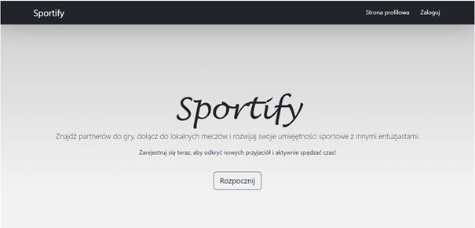
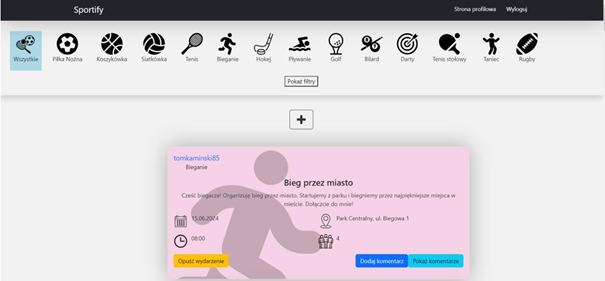
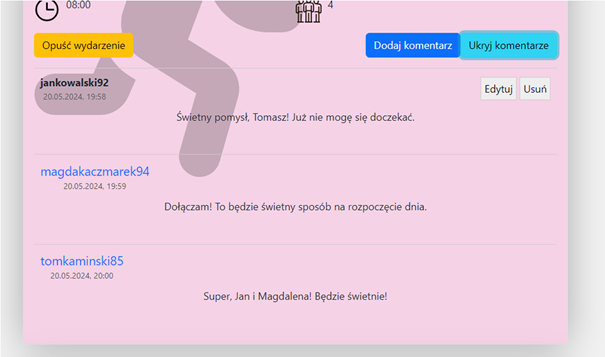

# SportPortal

## Description  
**SportPortal** is a social networking web application designed to help users organize and join sports games and find activity partners in their area. The platform streamlines event creation, participation, and communication among sports enthusiasts.

## Key Functionalities  
- **User Registration & Authentication**  
  - New users can create an account and log in to access the platform's full functionality.  
  - Users can update their personal data, change passwords, or delete their account.

- **Sports Event Posts**  
  - Logged-in users can create posts to organize sports events and invite others to join.  
  - Posts can include details such as the type of sport, location, date, and time.  
  - Posts are visible on the main feed and can be edited or deleted by their authors.  

- **Post Filtering & Discovery**  
  - Users can browse all public posts and filter them by sport, date, or time to quickly find suitable events.  

  

- **Joining & Leaving Events**  
  - Users can join events created by others and see who else is participating.  
  - Users can also leave events they previously joined.  

- **Commenting System**  
  - Users can add comments under posts to communicate with event organizers or participants.  
  - Comments can be edited or deleted by their authors.  

  

- **User Profiles**  
  - Users can view their own profile with a summary of events they created or joined.  
  - It’s also possible to view public profiles of other users to learn more about them or see their activity.

## Technology Stack

### Frontend (React + JavaScript)
- **React.js** for dynamic UI components  
- **JavaScript**, **HTML**, **CSS**  
- **Bootstrap** for responsive styling  

### Backend (Java + Spring Boot)
- **Spring Boot** for building RESTful APIs  
- **Java** as the core programming language  
- **Postman** used for API testing  

### Database (MySQL)
- **MySQL** for persistent data storage  

## Project Highlights
- Full-stack architecture with clean separation of concerns  
- Secure login and data handling  
- Intuitive, user-friendly interface for organizing sports events  
- Comment and participation features that enhance community engagement
